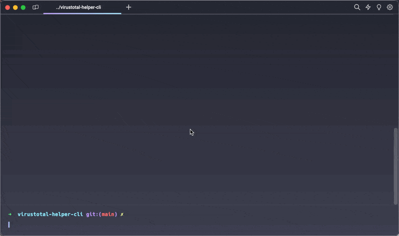

# VirusTotal Helper CLI

## Description:

Interactive CLI written in Node.js that checks a file of hashes in VirusTotal. This allows folks to find a file name and associated hashes, check verdict of popular or specific vendors, or even grab all results from VirusTotal.

## Requirements

- At least Node.js 18.x
- [ VirusTotal API Key](https://www.virustotal.com/ " VirusTotal API Key")

## How to Use

- Open command prompt/terminal
- Run Node.js script

```shell
npm install
npm start
```

- Follow the prompts

## Demo

